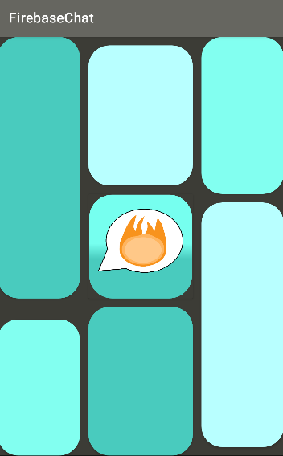
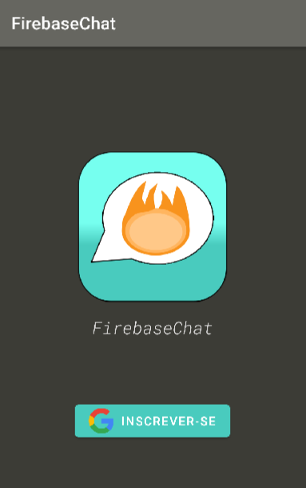
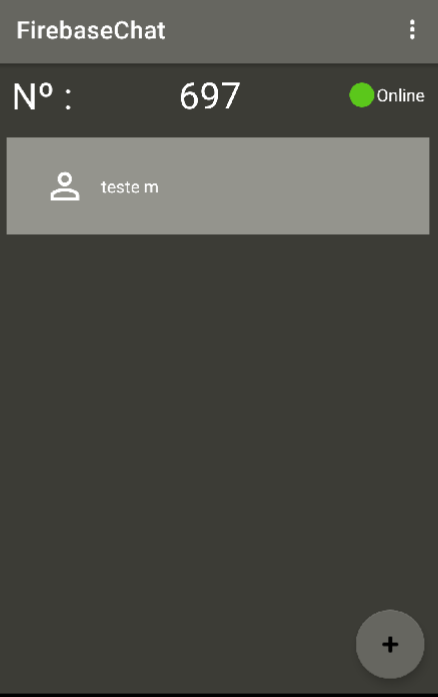
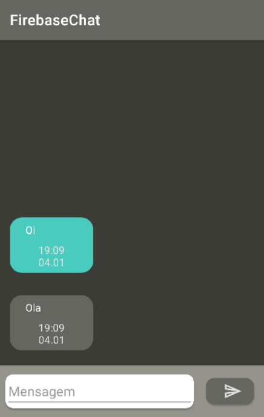
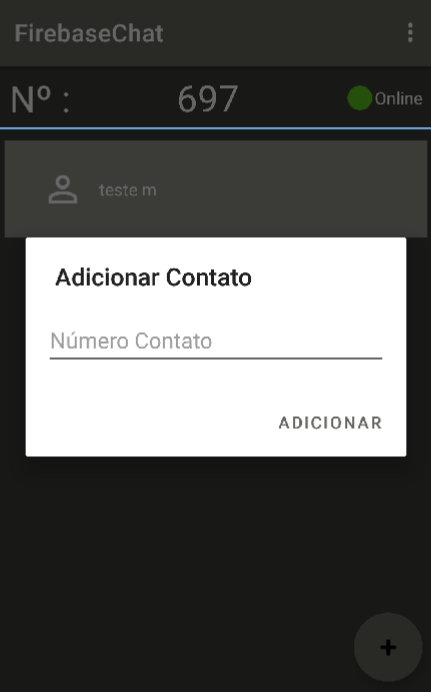
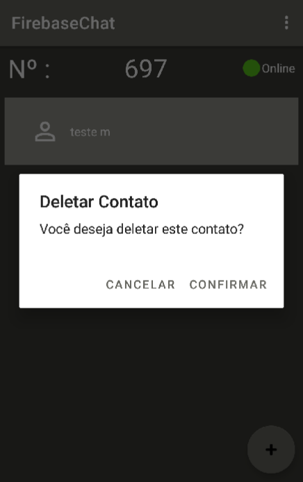
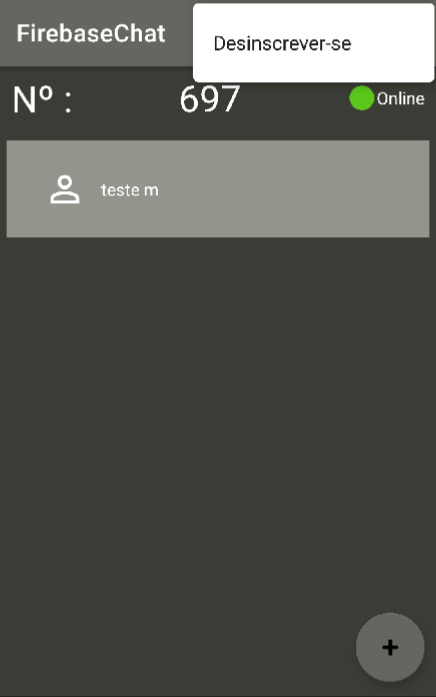

# Firebase-Chat

Firebase Chat é um aplicativo de comunicação por texto online, que utiliza o Firebase do Google como Back-End.

-------

*SplashScreen* :

-------

*Inscrever-se* :

*Única forma de autenticação é pela conta do Google.*

-------

*Contatos* :

*O indentificador de cada usuário é um número aleatório que é atribuído assim que é autenticado no servidor. Esse número é usado para adicionar novos contatos e para criar os diretórios de cada conversa, sendo assim o id da conversa único.*

-------

*Conversa* :

*As mensangens são mostradas ao lado esquerdo contendo a data e o horário de cada mesangem.*

-------

*Adicionar Contato* :

*O número do contato que desejar adicionar deve ser colocado na caixa de texto.*

-------

*Deletar Contato* :

*O contato que for deletado não será mostrado na tela de Contatos, só poderá visualizar as mensagens novamente caso o contato seja readicionado.*

-------

*Desinscrever-se* :

*Ao pressionar em <b>Desinscrever-se</b> o usuário será apresentado com uma tela de confirmação, assim precisará escolher entre se quer Confirmar ou Cancelar a decisão. Caso a escolha seja Confirmar, será removido da autenticação e redirecionado à tela de <b>Inscrever-se</b> .*

-------

<h3>Ferramentas:</h3>

- **Arquitetura MVVM**;

- **Room**;

- **RecyclerView / DiffUtil**;

- **Navigation Fragment**;

- **Coroutine**;

- **Data Binding**;

- **Firebase**;
